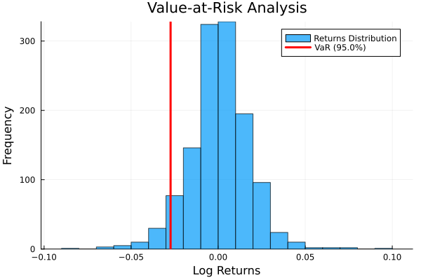

# Value at Risk (VaR) Analysis Application

This application provides a comprehensive tool for calculating and visualizing Value at Risk metrics using Julia.

## Interface

## Output

## Analysis Visualization

## Features
- Interactive GUI built with Gtk.jl
- CSV data import functionality
- Smart price column detection
- Configurable confidence levels
- Visual VaR representation through histograms
- Statistical summary including:
  - Mean returns
  - Standard deviation
  - Number of data points analyzed

## Technical Implementation
- Built with Julia
- Uses Gtk.jl for GUI
- Implements statistical calculations using native Julia functions
- Visualization powered by Plots.jl

## Getting Started
1. Clone the repository
2. Install required Julia packages
3. Run `app.jl` to start the application

## Usage
1. Click "Open CSV" to load your financial data
2. Set your desired confidence level
3. Click "Calculate VaR" to perform the analysis
4. View results and histogram visualization
